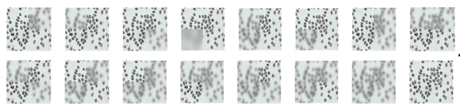
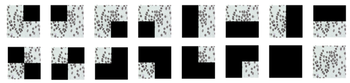

## Use Quadrant-based Feature Reduction
1. Generate quadrant masked images using files in the `masked_image_generation` or you can also use generated images in the `output_shap`.
   1. Gaussian-based: 
      1. Open `gaussian_masked_image_generator.py`
      2. Change `filename` to your desired image directory.
      3. Run
      4. It should produce images like bellow

      
   2. Simple black-out:
       1. Open `masked_image_generator.py`
       2. Change `filename` to your desired image directory.
       3. Run
       4. It should produce images like bellow
      
       
   
2. Change the generated file directory in the python file under `shap_cal` to run shapley value calculation.
   1. Runn the `shap` python file accordingly based on your generated images. i.e. if you use generate gaussian based images, run `shap_mike_withGaussianMask.py`