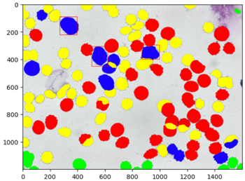

# Example of using Shapley Anything Model

1. Upload ths directory `./The Shapley Anything Model` to Google Drive.
2. Open `SHAM_Shapley_Calculation_Pipeline.ipynb` in the Google Colab.
3. Change the `root_path` to the directory of this folder on google drive.
4. Run the whole file.
5. It will display a colored images with each color representing a kmeans cluster, and red bounding box representing the ground-truth sick cell position.
6. Red: cluster 1, green: cluster 2, blue: cluster 3, yellow: cluster 4



6. Shapley value will be displayed as a nested list as `[(cluster_id, shapley_value), ...]`
 ```
   [[1, 0.2103462765614192],
   [2, -0.013461478054523468],
   [3, 0.37271041174729663],
   [4, 0.17959196865558624]]
```